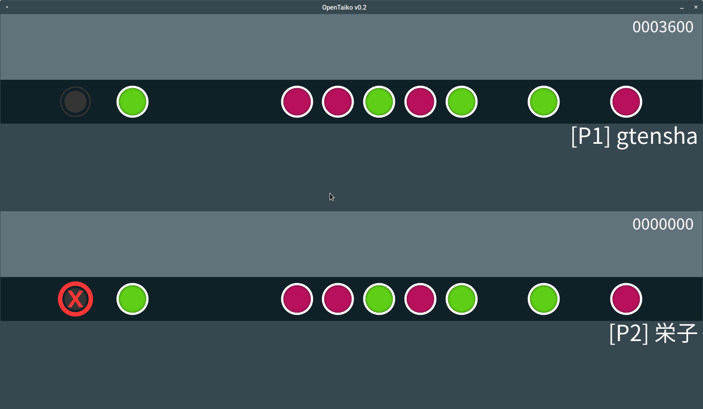

# OpenTaiko
OpenTaikoは、GPLv3されてる音ゲームです。D言語で書いてあって、グラフィックはSDL2([DerelictSDL2][3])で、サウンドとしてはSFML2([DerelictSFML2][4])を利用しています。




_※画像は現在のゲームと違っている可能性があります。_

# 始める前に
OpenTaikoを使う前に、コンパイラーとその他の必要なことを準備しましょう。違うOSは違うインストール方法がありますので、使用されているOSだけのインストール方法をご覽ください。バイナリーリリースに関している機能は詳しく決めてないため、まだ配信しません。

# コンパイラー
現在、dmdしか完全に対応しません。しかし、場合によって他のコンパイラーも使えるようになるかもしれません。なお、ldcサポートは将来の目的です。

dmdとderelict-sdl2のバグのため、dmdを使えると「-release」フラグをつけば実行時にエラーが出てしまいそうなので、現在「debug」しか利用できません。

# 必要な物（パッケージなど）
* dmd
* dub
* SDL >= 2.0
* SDL2\_ttf
* SDL2\_image
* ffmpeg、コマンドライン系（SFML2はmp3対応がないので、ffmpeg使えれば遊ぶ時にmp3をoggに、再生できられる）
* csfml-audio-2

利用しているプラットフォームにcsfmlがない場合はSDL\_mixerも使えられるが、音楽再生計時能がなくて、正しく実行しない場合があります。なお、音質が悪くなる可能性もありますので、できればcsfmlを使ってください。

## DUB dependencies
dub.sdlをご覧ください。

## OS特有やり方
自分のOSのやり方がここにない場合は一般的なやり方を行い、成功したらその後はご自由にこのファイルに詳しいやり方を追加しても他のユーザーを助かれます。

### Linux
どんなディストロでもOpenTaikoはコンパイルと実行するはずです。

#### 一般的に
ディストロのパッケージマネージャーを使って、「必要な物」から必要なものだけをインストールするのが基本的なやり方です。普通にこんなところまでです。

#### Debian/Devuan (stable)
aptを使って、こちらのパッケージをインストールします。

* libsdl2-2.0-0
* libsdl2-image-2.0-0
* libsdl2-ttf-2.0-0
* libcsfml-audio2.3
* ffmpeg

```
apt install libsdl2-2.0-0 libsdl2-image-2.0-0 libsdl2-ttf-2.0-0 libcsfml-audio2.3 ffmpeg
```

dubとdmdが公的なリポジトリにありませんので、dlang.orgからの [official installer](https://dlang.org/download.html)を使います。

```
wget http://downloads.dlang.org/releases/2.x/2.084.0/dmd_2.084.0-0_amd64.deb
```

ダウンロード済みの.sigファイルを使ってインストール前にパッケージの確認を行いましょう。

```
sudo dpkg -i dmd_2.084.0-0_amd64.deb
```

### Windows
まず、[dlang.org](https://dlang.org/download.html#dmd)からdmd installer exeを手に入ります。説明どおりにインストールして、Visual Studio対応の質問に「do nothing」を答えてdmdとdubがインストールされるのを待つだけです。

gitを持っている場合はgit cloneでOpenTaikoのリポジトリをクローンします。でもWindowsで使い辛いし、持っていない方は.zipを手に入ることもできますので、試したい方には一番便利な方法かもしれません。

次は必要な.dllファイルとffmpegを手に入れましょう。64-bitマシンが持っている方に64-bitの.dllが必要で、32-bitマシンは32-bitの.dllなので、気をつけて正しいのをダウンロードしましょう。ダウンロードした.dllをOpenTaikoディレクトリに運びます。SDL2なら様々な.dllが付いていますので、必ずそれも運びましょう。

こちらの.dllをダウンロードします。

* [SDL2](http://libsdl.org/download-2.0.php)
* [SDL2-ttf](https://www.libsdl.org/projects/SDL_ttf/) 「Runtime Binaries」下のWindows系を選びます
* [SDL2-image](https://www.libsdl.org/projects/SDL_image/)前と同じくやって、zlibを書き換えても構いません
* [CSFML](https://www.sfml-dev.org/download/csfml/)、Windowsの一番新しいやつを。ダウンロードした.zipの「bin」ディレクトリから「csfml-audio-2.dll」を運ぶだけで十分です

その後は前と同じように[ffmpeg.exe](https://ffmpeg.zeranoe.com/builds/)をダウンロードして、ffmpeg.exeをOpenTaikoディレクトリに運びます。今度も要る実行ファイルが「bin」ディレクトリにあります。

続いて[OpenAL redistributable](http://openal.org/downloads/oalinst.zip)を手に入れましょう。インストーラーを実行したくない場合は[SFML builds](https://www.sfml-dev.org/download/sfml/2.5.1/)からのバージョンを選んで、zipファイルにあるopenal32.dllを前と同じように使っても平気です。

OpenTaikoのコンパイル準備ができました。cmdを実行してOpenTaikoディレクトリを選びます。簡単に正しいディレクトリを選べるようにExplorerのアドレスバーからcdコマンド後にコピペできます。スペースや特別文字があるパスならご覧のように「"」を追加しましょう。

```
cd "C:\Users\gtensha\Projects\OpenTaiko-0.2"
```

最後はビルドを行うだけです。64-bitマシンなら--arch=x86\_64のフラグを付けましょう。32-bitの場合は--arch=x86を使います。それと--config=SFMLMixerのフラグも必要です。フラグを追加してdub buildのコマンドを実行します。

```
dub build --config=SFMLMixer --arch=x86_64
```

最初ならdubがネットからdependencyをGETしますので少々お待ちください。

完成したらOpenTaiko.exeがディレクトリに出てきました。OpenTaikoの実行時にエラーが出たら、もう一度上のことを確認してください。特に、マシンに正しいdllバージョンを手に入れたことを確認してください。

### BSD
ただいまBSDのサポートをよく確認していませんが、ほとんどのBSDは必要なライブラリーが利用可能なので、できるかもしれません。

### MacOS
状況不明なのですが、できるはずです。

## ビルド方法
OpenTaikoはビルドシステムとしてdubを利用しています。dubはOSのコマンドラインから実行します。なお、作業ディレクトリはOpenTaikoにクローンしたディレクトリにセットします。

```
dub run
```

を実行したら、OpenTaikoはビルドされて、実行します。

```
dub build
```

ならビルドだけを行います。まだSFMLサポートに必要なので
```
--config=SFMLMixer
```
フラグも忘れないように。

どちらのコマンド系を選んでも本ディレクトリにOpenTaikoの実行ファイルが出てきます。ほかのディレクトリに運びせずに後から自由に実行できます。

本マシンにコンパイルしたい方は普通にプロセッサーのISAを特定する必要がないのですが、64-bitのWindowsユーザーなら特定しないと32-bitバイナリーになるし、64-bit dllを利用できなくなります。フラグとして
```
--arch=x86_64
```
を付けたら64-bitのビルドを行います。自由にフラグを交えて実行します。

```
dub build --config=SFMLMixer --arch=x86
```

上のコマンドはSFMLサポート付きの32-bit x86ビルドとなります。

初ビルドにはネットからdependenciesのダウンロードによって少々時間がかかるかもしれません。この時はネットワーク接続が必要なので気をつけてください。その後は自由にオフラインでも作業をつついても平気です。手でdependencyを手に入る方法に関しての情報が知りたいならdubの文書化をご覧ください。

## 遊び方
OpenTaikoはキーボードで遊べます。コントローラーのサポートは将来の目的です。一人だけじゃなくて、同じキーボードで（もしは本コンピューターに接続されてる他のキーボードもOK）数人と同時に遊ぶこともできます。

### キーボードの使い方
ドラムを叩くにはキーボードを使います。マウスはサポートされていません。

メニューを動かすには矢印キーを使います。ENTERをおすと決定し、ESCAPEなら前のメニューに戻ります。タイトル画面まで戻りさらにもう一度ESCAPEをおすとゲームを終了します。メニューカテゴリから選択するにはTABをおします。

遊ぶ時にプレイヤー１の叩くキーはデフォールト[D F J K]に設定されています。Dは左カツで、Fは左ドンと言う感じになります。プレイヤー２の場合は[End PageDown Numpad8 Numpad9]に設定されています。

#### キーを変更する
キーを変更するには「プレイヤー」メニューに移動して、「キーマップを設定する」オプションを選択します。キーを追加したい場合はESCAPE以外いずれかのキーをおすとそのキーは追加されます。

キーの設定は_keybinds.json_に登録しています。このファイルはテキストエディタで変更しても平気です。設定はプレイヤーナンバーに関してのみです。特定のプレイヤーに設定していません。

プレイヤーのキーを再セットしたくなったら、「プレイヤー」メニューにある機能を使えます。

### プレイヤーを追加する
始めに「Player」のプレイヤーをもらいます。他のプレイヤーを登録するには、「プレイヤー」メニューに移動して、「プレイヤーを選ぶ」オプションを選択します。その後は登録されたプレイヤーから選べ、もしは新しいプレイヤーを登録するのもできます。プレイヤーを追加すると遊ぶ時に各プレイヤーがプレイヤーエリアをもらえて、同時に遊べます。遊んでいるプレイヤーは右上に表示されます。

「プレイヤーを削除する」オプションはプレイヤーを演奏から抜かすためです。登録されたプレイヤー一覧から消しません。

プレイヤー一覧は_players.json_に登録されています。そちらも、テキストエディタで変更を行っても平気です。

### 曲を追加する
曲を追加するには自分でゲーム譜面を作るか誰かが創作したのを手に入ることもできます。なお、ゲームによって他のから譜面をインポートするのも可能です。

#### ゲーム譜面の制作
制作機能はまだ完全に決めてないので、手間はかかりますが、手で制作できます。やり方を習うにはmapsディレクトリーにある見本をご覧ください。

制作されたゲーム譜面を追加するにはそのマップのディレクトリーをmapsにコピーするだけです。

#### ゲーム譜面をインポートする
.oszファイルからゲーム譜面をインポートすることができます。自動的にその中にあるbeatmapをOpenTaikoの譜面ファイルに変更して、ffmpegが利用可能ならmp3もoggに変更します。ffmpegを持ってないならゲーム中に音楽が再生できない可能性があります。インポート後で.oszは消しません。

インポートするには「設定」メニューから「マップをインポートする」のボタンをおしてください。

### ゲーム設定
「設定」メニューに言語を設定したりvsyncモードをセットしたりことなどができます。レゾリューションをセットするには_settings.json_のファイルをエディットして、「resolution」を好きな値に変更できます。

現在では設定した後でゲームを再機動する必要があります。

### 遊び方
ドラムが打つ場所にきたらとキーボードで正しいタイミングで叩きます。赤はドラムの真ん中のキーで、緑はドラムは周りのキーで叩きます。右や左のボタンのどっちでもOKです。タイミングが良ければスコアもよくなります。リズムをよく聞いて叩くのがコツです！

開発が進むともっと機能が追加されます。

# 目的
どんなマシンを使っても遊べる音ゲーになること。

同じマシンでもネットでもマルチプレイヤー機能があって、楽しくて楽にできること。

同じ感じのゲームからマップのインポートができたり、簡単にテキストファイルの変化を行ってマップ作成できたりすること。

コードにたいして誰でも簡単に変化するように、ソースコードが読みやすくてよく実行すること。直したり追加したりこといっぱいあるのでその状況になるまでももちろん投稿が受け入れられています。

OpenTaikoはGNU GPLv3のフリーソフトため、すべてをフリーソフトままで配信できるようにフリーな共有ライブラリを使いのみのこと。

# コピーライト知らせ
こちらのレポジトリーに付いているファイルは作者よりコピーライトされたものです。

## Noto fonts
**© 2010-2015, Google Corporation**

### ファイル

* assets/default/NotoSansCJK-Bold.ttc
* assets/default/NotoSansCJK-Light.ttc
* assets/default/NotoSansCJK-Regular.ttc

### ライセンス
[SIL Open Font License](assets/default/LICENSE.NotoSansCJK.txt)

### ホームページ
[GitHubレポジトリー](https://github.com/googlei18n/noto-cjk)

[3]: https://github.com/DerelictOrg/DerelictSDL2
[4]: https://github.com/DerelictOrg/DerelictSFML2
